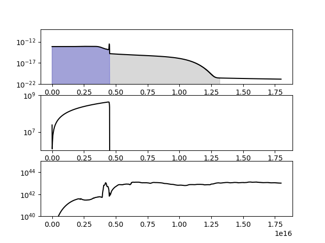

# AMR_IO_tools
Codes and scripts for reading data from AMR hydrodynamic simulations
Currenlyt, python scripts are provided. Details are described below

# Dataset description
A single simulation data (e.g., snap.h5) is a snapshot of radiation-hydrodynamic simulation in 2D cylindrical coordinate (r,z). 
Since the original simulations employ adaptive-mesh-refinement (AMR), the grid structure and resolution can be different from a domain to another. 
Variables on specific numerical cells (e.g, density, velocity, and so on) are therefore kept in a hierarchical way, which is complicated. 
Ths following codes help users to extract values at specific points on the simulation domain, output them in ASCII format, and make plots. 


# HDF5 setting
Simulation data are stored in HDF5 (Hierarchical Data Fromat version 5; https://www.hdfgroup.org/solutions/hdf5/).
In order to read HDF5 files, you need to install h5py module (https://docs.h5py.org/). 
Installation can be completed by following the instruction given by https://docs.h5py.org/en/stable/build.html.


# How to use
The current version of repository contains a Python script, `read_model.py`, and three examples, `read_snapshot.py`, `make_1d_plot.py`, and `make_2d_plot.py`. 
The script `read_model.py` contains some basic functions to explore the data. 
Users are not supposed to directly modify this script. 
The three example codes show how to read and analyze a sample data file `snap.h5`, which should be located in the same directory. 
`snap.h5` is a sample data of spherical supernova ejecta (10 Msun) with spherical circumstellar material (2 Msun). 


## read_snapshot.py
This example explains how to use basic functions provided by `read_mdoel.py`
The code reads the data file and extracts some values. 
- First of all, the code starts with iimporting necessary modules:
  ```
  import numpy as np
  import h5py
  import read_model
  ```
- Next, input filename is specified:
  ```
  input_file="./snap.h5"
  ```
- The main part starts with:
  ```
  with h5py.File(input_file, mode='r') as f:
  ```
  , which opens the file as f and initialize the model data
  ```
  model = read_model.data(f)
  ```
  Now, you can use functions provided by `read_model` for the dataset.
- After data loading, the code botains and prints the epoch and the domain of the simulation.
  ```
  print(model.time)
  print(model.range)
  ``` 
  In this example, the corresponding output on the terminal should look like:
  ```
  10367926.400037047
  [       0.          4269620.41853635 -4269620.41853635  4269620.41853635]
  ```
  The units of the time and coordinates are seconds and light-seconds (~ 3.0e10 cm).
  The first line means the simulation epoch is t = 10367926.400037047 ~ 120 days.
  The simulatin domain is expressed by a Numpy array with 4 components, (r_min, r_max, z_min, z_max).
- Users can check the physical variables contained in the data:
  ```
  print(model.var.keys())
  ``` 
  The corresponding output would look like:
  ```
  dict_keys(['rho', 'v1', 'v2', 'v3', 'e_gas', 'e_rad', 'f1', 'f2', 'f3', 'e_rad_nt', 'f1_nt', 'f2_nt', 'f3_nt', 'Xej', 'Xcsm', 'Xrad', 'Xel', 'Xh', 'Xhe', 'Xc', 'Xn', 'Xo', 'Xne', 'Xmg', 'Xsi', 'Xs', 'Xar', 'Xca', 'Xfe'])
  ```
  Each label stands for density (rho), 3 components of velocity (v1, v2, v3), gas energy density (e_gas), thermal radiation energy density (e_rad), thermal radiation flux (f1, f2, f3), non-thermal radiation (e_rad_nt, f1_nt, f2_nt, f3_nt), ejecta mass fraction (Xej), CSM+ejecta mass fraction (Xcsm), mass fraction of radioactive nickel (Xrad), electron mass fraction (Xel) and mass fractions of 12 elements (Xh to Xfe).
- Users can also check the units used for physical variables:
  ```
  print(model.var.keys())
  ``` 
  , which returns 
  ```
  {'r': 29979245800.0, 'z': 29979245800.0, 'rho': 1.0, 'v1': 29979245800.0, 'v2': 29979245800.0, 'v3': 29979245800.0, 'e_gas': 8.9875518e+20, 'e_rad': 8.9875518e+20, 'f1': 2.6944002e+31, 'f2': 2.6944002e+31, 'f3': 2.6944002e+31, 'e_rad_nt': 8.9875518e+20, 'f1_nt': 2.6944002e+31, 'f2_nt': 2.6944002e+31, 'f3_nt': 2.6944002e+31}
  ```
  In the orignal simulations, pysical variables are normalized by using the speed of light and second or 3rd powers. c, c^2, or c^3. 

- Here, we retrieve density (rho), velocity (v1), and the radiation energy density (e_rad) by using the function `get_values()`:
   ```
   r = 1.0e6
   z = 2.0e6
   print(model.get_values(f,[r,z],["rho","v1","e_rad"]))
   ```
  Users give file f, the coordinate r and z, and the name list of variables (rho, v1, e_rad) for `get_values()`.
  In this example, we access vriables at r = 1e6 and z = 2e6, which is inside the numerical domain range.
  The corresponding terminal output should be
  ```
  [1.1166868116161294e-22, 2.6709488609033433e-09, 8.661066136634234e-24]
  ```

## make_1d_plot.py

This example retrieve physical values from the model data, saves them in an ASCII format, and makes 1D plots. 
- In this example, after loading the model data with `read_model.data()`, the code makes the list of coordinates (r,z), `rad_list`. 
  ```
  rad_list = []
  var_list = []
  for n in range(2000):
      r = 1.0
      z = 0.0 + 30.0e1 * n
      rad_list.append(np.sqrt(r**2 + z**2))
  ```
  Here, r is fixed to unity and z in increased from 0 to 6000000. The norm of each coordinate is sotred in `rad_list` for later use. 
- Then, the code retrieve several variables at the specified locations and keep them in a list `ver_list`. 
  ```
      var_list.append(model.get_values(f,[r,z],["rho","v1","v2","f1","f2","Xej","Xcsm"]))
  ```
- Now, `rad_list` and `ver_list` contains 2000 set of radius and variables specified above. 
  For example, you can check the first 10 items in the list:
  ```
  print(rad_list[:10])
  print(var_list[:10])
  ```
- Next, the code saves the retrieved values in a test file. The output filename has been specified at the top of the script:
  ```
  output_file="./test.txt"
  ```
- The output part is written like this:
  ```
  with open(output_file, mode="w") as fout:
    for n in range(len(rad_list)):
        fout.write(str(rad_list[n])+" ")
        for var in var_list[n]:
            fout.write(str(var)+" ")
        fout.write("\n")
  ```
  , in which the output file is opened as `fout` and `fout.write` is used to write the values down. 

- This part is followed by plotting part, which makes 1D radial profiles of the density, the velocity, and the outgoing luminosity. For making plots, the code imports matplotlib in the beggining:
  ```
  import matplotlib.pyplot as plt
  import matplotlib.gridspec as gridspec
  ```
  Users may learn how to use matplotlib in `https://matplotlib.org/stable/`.

- First, the code initializas the figure and define three subplots, ax1, ax2, ax3:
  ```
  fig=plt.figure()
  ax1 = fig.add_subplot(311)
  ax2 = fig.add_subplot(312)
  ax3 = fig.add_subplot(313)
  ```
- In the top panel (ax1), the code plots the radial density profile obtained in the data retrieving part. 
  ```
  ax1.plot(np.array(rad_list)*model.units["r"], 
           np.array(var_list).T[0]*model.units["rho"],
           label="rho",color="black")
  ```
  Here, density is simply plotted as a fucntion of radius, but in physical unit. 
  `np.array(rad_list)` converts the radius list `rad_list` into 1D array (2000,). 
  `np.array(var_list)` converts the variable list `var_list` into 2D array (2000, 7). 
  The transpose `np.array(var_list).T` has its shape of (7, 2000) for plotting purpose. 
  By multiplying `model.units["r"]` and `model.units["rho"]`, the radius and density (normalized in the raw data) recoverdd their physical dimension. 
- The code has retrieved the ejecta mass fraction Xej and CSM mass fraction Xcsm. These values are equal to 1 in ejecta (CSM) and 0 outside ejecta or CSM. 
  Therefore, the product rho * Xej, for example, is equal torho in the ejecta, while is zero outside the ejecta. 
  The following commant therefore fill the ejecta and ejecta+CSM with blue and gray color. 
  ```
  ax1.fill_between(np.array(rad_list)*model.units["r"], 
                   np.array(var_list).T[0]*model.units["rho"]*(np.array(var_list).T[5]), 
                   color="blue",alpha=0.3)
  ax1.fill_between(np.array(rad_list)*model.units["r"], 
                   np.array(var_list).T[0]*model.units["rho"]*(np.array(var_list).T[6]), 
                   color="gray",alpha=0.3)

  ```
- The resultant figure should look like this:


  